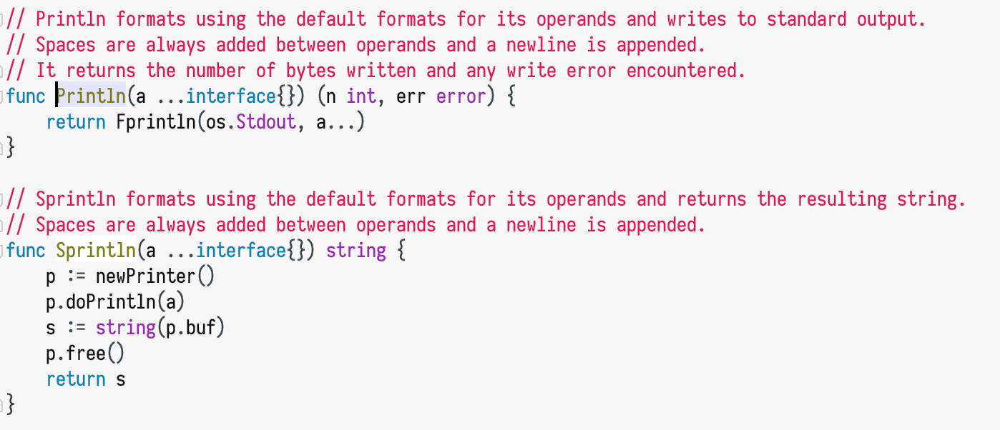

# Tibau2 Theme for IntelliJ-based IDEs

This theme is inspired from [Google Developer Tibau Theme](https://github.com/richellyitalo/google-developer-tibau-theme/), with small modified. And, I highly recommend [Iosevka font](https://github.com/be5invis/Iosevka) for programming, it's awesome and free(dom).

## Feature

* Compatible with all IntelliJ-based IDEs
* Light style color theme
* Tiny and clean skips redundance colors
* Optimized for Golang and Java
* Don't modify your font config
* Suitable for longtime coding :^)

## How to Install?

Open your IDE `Preferences > Plugins` Search `tibau2` to [install](https://plugins.jetbrains.com/plugin/12324-tibau2-color-scheme).

or

Manual Install: Open `Preferences > Editor > Color Scheme` and select `Import Scheme` with drop down menu, import `tibau2.icls` that's it!

## Screenshots

### Golang

### Javascript

### PHP

### HTML

`- eof -`
